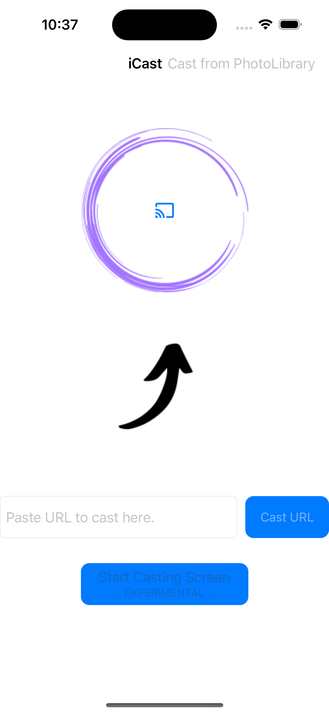

# iCast
*Por: Brian Jiménez Moedano*

*Agosto 2023*

## Descripción

**iCast** es una aplicación que sirve para **transmitir archivos multimedia locales y remotos a un dispositivo Google Chromecast** disponible en la misma red local WIFI a la que se conecta el iPhone. La App utiliza el servidor remoto de **Google Cloud Storage** para **subir temporalmente los archivos multimedia locales seleccionados desde la Photolibrary** del iPhone y lo transmite al dispositivo ChromeCast, también es posible **transmitir una url de la web** copiando y pegando dicha url en la App. Finalmente la App tiene una **funcionalidad experimental para transmitir la pantalla del iPhone al dispositivo ChromeCast**, sin embargo esta está en desarrollo y **NO** se recomienda utilizarla.

## Características

- Aplicación para transmitir archivos multimedia locales y remotos a un dispositivo **Google Cast.**
- Diseño de arquitectura **MVC.**
- El usuario puede acceder a sus archivos multimedia locales desde la **PhotoLibrary** de su iPhone.
- Servicio de almacenamiento temporal de archivos multimedia locales en **Google Firebase Cloud Storage.**
- Implementación del **SDK GoogleCast** para la conexión y transmisión de archivos multimedia.
- Uso del API **ReplayKit** para la función experimental de grabar la pantalla del iPhone.
- Uso del API **UIKit para la interfaz gráfica.**

## Cómo Utilizarla

Al abrir la aplicación, el usuario podrá conectarse a algún dispositivo Chromecast disponible en su red local WIFI con el botón de **Cast** disponible al centro de la pantalla principal de la App.

Una vez seleccionado el dispositivo a transmitir, el usuario puede **seleccionar archivos de su PhotoLibrary**, o **pegar una url con el archivo multimedia remoto a transmitir**.

Una vez que se indica la fuente del archivo a transmitir, la App **realizará el acondicionamiento necesario e iniciará los servicios de transmisión**, si todo salé bien, mostrará al usuario la **pantalla de transmisión y control**, la cual puede ser operada en **Full Mode o Mini mode.*

El usuario tambipen puede manipular la transmisión o terminarla completamente en cualquier momento con el botón de **Cast**.

Finalmente la App tiene una función de transmisión de la pantalla del iPhone, la cual **NO se recomienda utilizar ya que sigue en desarrollo.**

## Tecnologías/Frameworks

- **UIKit:** Para el diseño de la interfaz de usuario.
- **Google FireBase:** Para el servicio de alojamiento temporal de archivos locales.
- **MVC:** Como arquitectura de diseño principal.
- **Google Cast:** Para la conexión y transmisión a los dispositivos ChromeCast.
- **ReplayKit:** Para el servicio de grabación de pantalla.

## Licenciamiento

- **GNU GPLv3**
